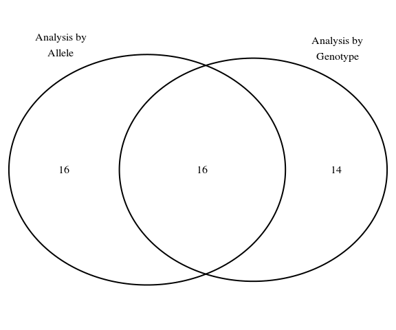

# SNP Analysis
Steve Pederson  
21 September 2017  


```r
library(tidyverse)
library(parallel)
library(pander)
library(scales)
library(reshape2)
library(VennDiagram)
```


```r
nCores <- min(12, detectCores() - 1)
logit <- binomial()$linkfun
theme_set(theme_bw())
```


# Introduction

This analysis takes the filtered SNPs from the [previous section](02_snpFiltering) and analyses their population frequencies amongst the two populations.
The two populations are referred to below as Population `1` (*Gum Creek*, 1996) and Population `2` (*Oraparinna*, 2012).

## Outline of analysis

The analysis uses two simple models fully described by Lewis in [Genetic association studies: Design, analysis and interpretation](https://doi.org/10.1093/bib/3.2.146) to detect statistically significant differences between the two populations

1. A *full genotype* model based on **genotype counts**, which will detect changes in the structure of heterozygous or homozygous nature of genotypes
2. A *multiplicative model* based on **allele counts** in which the impact of a single copy of an allele will be tested.

- Models were tested using Fisher's Exact Test to allow for low counts in contingency tables
- Multiple testing adjustments were performed using both *Bonferroni's method* and the *Benjamini-Hochberg method* to assess results in the context of both FWER and FDR control.

# Data Setup


```r
allData <- file.path("..", "data", "filteredSNPs.tsv") %>%
  read_delim(delim = "\t") 
```


```r
popSizes <- allData %>%
  group_by(`Pop ID`) %>%
  summarise(N = max(N)) %>%
  mutate(Population = c("1996", "2012")[`Pop ID`],
         Description = c("Gum Creek", "Oraparinna")[`Pop ID`]) %>%
  ungroup() %>%
  dplyr::select(contains("Pop"), Description, N)
```

Data from the 20,336 SNPs selected for testing was loaded, and sample sizes formed as a simple table.
Using the observed major allele frequencies (`P`) and heterozygote frequencies (`Obs Het`), the allele frequency and genotype frequency tables were constructed.


```r
allCounts <- allData %>%
  mutate(A = round(P*2*N, 0), 
         B = round((1-P)*2*N, 0), 
         AB = round(`Obs Het`*N, 0), 
         AA = round((A - AB)/2, 0), 
         BB = round((B - AB)/2, 0)) %>%
  dplyr::select(snpID, `Pop ID`, A, B, AA, AB, BB)
```

# Analysis

## Genotype Frequency Model

This model tests:  
H~0~: No association between genotypes and populations  
H~A~: An association exists between genotypes and populations


```r
genotypeResults <- allCounts %>%
  split(f = .$snpID) %>%
  mclapply(function(x){
    mat <- as.matrix(x[,c("AA", "AB",  "BB")])
    ft <- fisher.test(mat)
    data_frame(snpID = unique(x$snpID),
               p = ft$p.value)
  }, mc.cores = nCores) %>%
  bind_rows() %>%
  mutate(adjP = p.adjust(p, method = "bonferroni"),
         FDR = p.adjust(p, method = "fdr")) %>%
  arrange(p)
```


```r
alpha <- 0.05
```

Under the full genotype model:

- 0 genotypes were detected as being significantly associated with the two populations when controlling the FWER at $\alpha$ = 0.05
- 0 genotypes were detected as being significantly associated with the two populations when controlling the FDR at $\alpha$ = 0.05
- If controlling the FDR at 10% however, a total of 30 genotypes were considered as potentially associated with the population structure 
- For the most highly ranked SNP (147965_18), the minor allele has been completely lost in the 2012 population


|      Chr |        BP | snpID     |         p |   adjP |     FDR |
|---------:|----------:|:----------|----------:|-------:|--------:|
|        7 | 131862327 | 147965_18 | 6.312e-06 | 0.1284 | 0.09205 |
|        5 |  12946260 | 158509_87 | 1.365e-05 | 0.2776 | 0.09205 |
|       20 |  14022385 | 64526_24  | 1.384e-05 | 0.2814 | 0.09205 |
|       13 | 125904892 | 104906_36 | 1.811e-05 | 0.3682 | 0.09205 |
|       14 |  34667589 | 98522_63  | 2.712e-05 | 0.5515 | 0.09291 |
|       14 |  92793012 | 101831_18 | 2.741e-05 | 0.5574 | 0.09291 |
|       18 |  25311139 | 72765_47  | 4.157e-05 | 0.8454 |  0.0943 |
|       18 |  25311176 | 72766_17  | 4.157e-05 | 0.8454 |  0.0943 |
|       18 |  25311153 | 72765_61  | 5.227e-05 |      1 |  0.0943 |
| GL018754 |   1365061 | 37345_16  | 5.665e-05 |      1 |  0.0943 |
|        6 |  27103576 | 157157_45 |  5.68e-05 |      1 |  0.0943 |
| GL018881 |     24230 | 21896_11  | 6.265e-05 |      1 |  0.0943 |
|        6 |  27103573 | 157156_58 | 6.578e-05 |      1 |  0.0943 |
|       17 |  69838525 | 80772_39  | 8.448e-05 |      1 |  0.0943 |
|        2 |  47053622 | 185586_34 | 8.657e-05 |      1 |  0.0943 |

Table: Top 15 most highly ranked SNPs when analysing by genotype

<!-- # ```{r top10GenotypeFreqs, echo = FALSE, fig.cap="Genotype frequencies for the 10 most highly ranked SNPs", fig.width=8} -->
<!-- # allCounts %>% -->
<!-- #   filter(snpID %in% genotypeResults$snpID[1:10]) %>% -->
<!-- #   group_by(snpID, `Pop ID`) %>%  -->
<!-- #   dplyr::select(contains("ID"), AA, AB, BB) %>% -->
<!-- #   melt(id.vars = c("snpID", "Pop ID"), variable.name = "genotype", value.name = "count") %>% -->
<!-- #   left_join(popSizes) %>% -->
<!-- #   mutate(Frequency = count / N, -->
<!-- #          Population = as.factor(Population),  -->
<!-- #          snpID = factor(snpID, levels = unique(genotypeResults$snpID[1:10]))) %>% -->
<!-- #   ggplot(aes(x = genotype, y = Frequency, fill = Population)) + -->
<!-- #   geom_bar(stat = "identity", position = position_dodge()) + -->
<!-- #   facet_wrap(~snpID, ncol = 3) + -->
<!-- #   scale_fill_manual(values = c(rgb(0.1, 0.1, 0.1), rgb(0.2, 0.2, 0.8))) + -->
<!-- #   labs(x = "Genotype", -->
<!-- #        y = "Frequency", -->
<!-- #        fill = "Population") + -->
<!-- #   theme_bw() + -->
<!-- #   theme(legend.position = c(2/3, 0.1), -->
<!-- #         legend.direction = "horizontal") -->
<!-- # ``` -->

## Allele Frequency Model

This model tests:  
H~0~: No association between allele frequencies and populations  
H~A~: An association exists between allele frequencies  and populations


```r
alleleResults <- allCounts %>%
  split(f = .$snpID) %>%
  mclapply(function(x){
    mat <- as.matrix(x[,c("A", "B")])
    ft <- fisher.test(mat)
    data_frame(snpID = unique(x$snpID),
               p = ft$p.value)
  }, mc.cores = nCores) %>%
  bind_rows() %>%
  mutate(adjP = p.adjust(p, method = "bonferroni"),
         FDR = p.adjust(p, method = "fdr")) %>%
  arrange(p)
```

Under this model:

- 2 SNP alleles were detected as being significantly associated with the two populations when controlling the FWER at $\alpha$ = 0.05.
However, as these SNPs were within 21nt of each other, this may represent the same haplotype 
- 16 SNP alleles were detected as being significantly associated with the two populations when controlling the FDR at $\alpha$ = 0.05
- extending the FDR to 10% yielded 32 SNP alleles


|      Chr |          BP | snpID     |         p |    adjP |     FDR |
|---------:|------------:|:----------|----------:|--------:|--------:|
|        4 |  84,940,235 | 167108_14 | 9.143e-07 | 0.01859 | 0.01189 |
|        4 |  84,940,214 | 167107_60 | 1.169e-06 | 0.02378 | 0.01189 |
|       14 |  92,793,012 | 101831_18 | 4.112e-06 | 0.08363 | 0.02277 |
| GL018713 |     365,938 | 50206_34  | 4.478e-06 | 0.09107 | 0.02277 |
|       14 |  34,667,589 | 98522_63  | 8.562e-06 |  0.1741 | 0.02598 |
| GL018881 |      24,230 | 21896_11  | 1.159e-05 |  0.2357 | 0.02598 |
|        7 | 131,862,327 | 147965_18 | 1.235e-05 |  0.2512 | 0.02598 |
| GL018881 |      88,327 | 233206_29 | 1.266e-05 |  0.2574 | 0.02598 |
|        7 |   2,702,916 | 151249_77 | 1.431e-05 |   0.291 | 0.02598 |
|        7 |   2,702,919 | 151251_13 | 1.431e-05 |   0.291 | 0.02598 |
|       17 |  69,838,525 | 80772_39  | 1.468e-05 |  0.2985 | 0.02598 |
| GL018704 |   4,853,505 | 53831_42  | 1.533e-05 |  0.3118 | 0.02598 |
| GL018881 |      24,194 | 21896_47  | 2.106e-05 |  0.4283 | 0.03206 |
|       18 |  25,311,153 | 72765_61  | 2.434e-05 |   0.495 | 0.03206 |
|       18 |  25,311,139 | 72765_47  | 2.523e-05 |   0.513 | 0.03206 |
|       18 |  25,311,176 | 72766_17  | 2.523e-05 |   0.513 | 0.03206 |

Table: Top 16 most highly ranked SNPs when analysing by genotype

<!-- # ```{r top10AlleleFreqs, echo = FALSE, fig.cap="Allele frequencies for the 10 most highly ranked SNPs", fig.width=8} -->
<!-- # allCounts %>% -->
<!-- #   filter(snpID %in% alleleResults$snpID[1:15]) %>% -->
<!-- #   group_by(snpID, `Pop ID`) %>%  -->
<!-- #   dplyr::select(contains("ID"), A, B) %>% -->
<!-- #   melt(id.vars = c("snpID", "Pop ID"), variable.name = "allele", value.name = "count") %>% -->
<!-- #   left_join(popSizes) %>% -->
<!-- #   mutate(Frequency = 0.5*count / N, -->
<!-- #          Population = as.factor(Population),  -->
<!-- #          snpID = factor(snpID, levels = unique(alleleResults$snpID[1:15]))) %>% -->
<!-- #   ggplot(aes(x = allele, y = Frequency, fill = Population)) + -->
<!-- #   geom_bar(stat = "identity", position = position_dodge()) + -->
<!-- #   facet_wrap(~snpID, ncol = 4) + -->
<!-- #   scale_fill_manual(values = c(rgb(0.1, 0.1, 0.1), rgb(0.2, 0.2, 0.8))) + -->
<!-- #   labs(x = "SNP Allele", -->
<!-- #        y = "Frequency", -->
<!-- #        fill = "Population") + -->
<!-- #   theme_bw() + -->
<!-- #   theme(legend.position = c(7/8, 0.1), -->
<!-- #         legend.direction = "horizontal") -->
<!-- # ``` -->

## Comparison of Results


```r
fdr <- c(genotype = 0.1, allele = 0.1)
sigSNPs <- c(filter(genotypeResults,FDR < fdr["genotype"])$snpID,
             filter(alleleResults, FDR < fdr["allele"])$snpID) %>%
  unique %>%
  as.data.frame() %>%
  set_names("snpID") %>%
  mutate(genotype = snpID %in% filter(genotypeResults,FDR < fdr["genotype"])$snpID,
         allele = snpID %in% filter(alleleResults,FDR < fdr["allele"])$snpID)
```



### SNPs Associated With Populations Under Both Approaches

The list of SNPs detected as associated with the population structure under both approaches is given below.


| snpID     | Chr      |          BP | Change in log(OR) | P_1996 | P_2012 |  Allele_p | Genotype_p |
|:----------|:---------|------------:|------------------:|-------:|-------:|----------:|-----------:|
| 127156_20 | 10       |  14,373,457 |            -1.291 |    0.5 | 0.2157 | 5.695e-05 |  0.0001159 |
| 98522_63  | 14       |  34,667,589 |            -1.897 | 0.9375 | 0.6923 | 8.562e-06 |  2.712e-05 |
| 101831_18 | 14       |  92,793,012 |             2.407 | 0.7444 |   0.97 | 4.112e-06 |  2.741e-05 |
| 80772_39  | 17       |  69,838,525 |             1.584 | 0.5952 | 0.8776 | 1.468e-05 |  8.448e-05 |
| 72765_47  | 18       |  25,311,139 |            -1.417 | 0.8333 | 0.5481 | 2.523e-05 |  4.157e-05 |
| 72765_61  | 18       |  25,311,153 |            -1.413 | 0.8333 |  0.549 | 2.434e-05 |  5.227e-05 |
| 72766_17  | 18       |  25,311,176 |            -1.417 | 0.8333 | 0.5481 | 2.523e-05 |  4.157e-05 |
| 68946_78  | 19       |  32,825,478 |            -1.547 | 0.9062 | 0.6731 | 5.891e-05 |  0.0001032 |
| 151249_77 | 7        |   2,702,916 |             2.277 | 0.7788 | 0.9717 | 1.431e-05 |  9.629e-05 |
| 151251_13 | 7        |   2,702,919 |             2.277 | 0.7788 | 0.9717 | 1.431e-05 |  9.629e-05 |
| 147965_18 | 7        | 131,862,327 |               Inf | 0.8478 |      1 | 1.235e-05 |  6.312e-06 |
| 36566_45  | GL018758 |   1,220,835 |            -1.162 | 0.5096 | 0.2453 | 0.0001083 |  0.0001331 |
| 36567_12  | GL018758 |   1,220,869 |            -1.162 | 0.5096 | 0.2453 | 0.0001083 |  0.0001331 |
| 21896_47  | GL018881 |      24,194 |            -1.296 | 0.5426 | 0.2451 | 2.106e-05 |  0.0001127 |
| 21896_11  | GL018881 |      24,230 |            -1.334 | 0.5521 | 0.2451 | 1.159e-05 |  6.265e-05 |
| 233206_29 | GL018881 |      88,327 |             1.466 | 0.5357 | 0.8333 | 1.266e-05 |  9.849e-05 |

Table: Summary of changes in the major (P) allele between the two timepoints. Changes in the log Odds ratio of observing the major allele are given, along with estimated population frequencies. Results from testing by genotype or allele are given as raw p-values. All SNPs were considered as differentially associated with the two populations under both analyses to an FDR of 10\%.


### SNPs Associated With Populations Under Analysis By Allele Only


| Chr      | BP          |     snpID | Change in log(OR) | P_1996 | P_2012 |  Allele_p |
|:---------|:------------|----------:|------------------:|-------:|-------:|----------:|
| 1        | 88,290,774  | 200447_80 |            -1.354 |   0.86 | 0.6132 | 6.994e-05 |
| 10       | 14,373,501  | 127157_45 |            -1.266 |    0.5 |   0.22 | 9.337e-05 |
| 13       | 128,331,083 | 105215_39 |            -1.199 | 0.6304 | 0.3396 | 5.926e-05 |
| 16       | 69,850,541  |  87407_11 |            -1.183 |   0.62 | 0.3333 | 7.197e-05 |
| 16       | 69,850,609  |  208806_6 |             -1.14 |   0.61 | 0.3333 | 0.0001291 |
| 3        | 53,556,574  | 175501_56 |            -1.324 | 0.8796 | 0.6604 | 0.0001568 |
| 4        | 84,940,214  | 167107_60 |             1.987 | 0.6354 | 0.9271 | 1.169e-06 |
| 4        | 84,940,235  | 167108_14 |             1.997 | 0.6383 | 0.9286 | 9.143e-07 |
| GL018704 | 4,853,505   |  53831_42 |            -1.346 | 0.7045 |  0.383 | 1.533e-05 |
| GL018713 | 365,938     |  50206_34 |            -1.533 | 0.7857 | 0.4419 | 4.478e-06 |
| GL018717 | 314,346     |  48659_40 |            -1.471 | 0.8571 | 0.5795 | 8.114e-05 |
| GL018739 | 75,851      |  41475_63 |            -1.232 | 0.7273 | 0.4375 | 9.437e-05 |
| GL018878 | 365,646     | 218710_78 |            -1.214 | 0.6667 | 0.3725 |  7.13e-05 |
| GL018881 | 22,826      |  21889_62 |            -1.143 | 0.5755 | 0.3019 | 9.673e-05 |
| GL018881 | 24,192      |  21895_48 |              -1.2 | 0.5319 | 0.2549 | 7.644e-05 |
| GL018985 | 50,536      |   15651_5 |             1.432 | 0.6735 | 0.8962 | 0.0001242 |

Table: Summary of changes in the major (P) allele between the two timepoints. Changes in the log Odds ratio of observing the major allele are given, along with estimated population frequencies. Results from testing by allele count are given as raw p-values. All SNPs were considered as differentially associated with the two populations under the allele count analysis to an FDR of 10\%.


### SNPs Associated With Populations Under Analysis By Genotype Only


| Chr      | BP          |     snpID | Change in log(OR) | P_1996 | P_2012 | Genotype_p |
|:---------|:------------|----------:|------------------:|-------:|-------:|-----------:|
| 13       | 125,904,892 | 104906_36 |             2.278 |  0.093 |    0.5 |  1.811e-05 |
| 18       | 14,288,883  |  72030_54 |            -1.408 | 0.7347 | 0.4038 |  0.0001334 |
| 2        | 37,519,845  |  184763_8 |                -2 | 0.4348 | 0.0943 |  0.0001431 |
| 2        | 47,053,622  | 185586_34 |            -2.611 | 0.3571 | 0.0392 |  8.657e-05 |
| 20       | 14,022,385  |  64526_24 |            -1.971 | 0.7391 |  0.283 |  1.384e-05 |
| 5        | 12,946,260  | 158509_87 |             3.324 | 0.6429 | 0.9804 |  1.365e-05 |
| 6        | 27,103,573  | 157156_58 |            -1.588 | 0.6981 | 0.3208 |  6.578e-05 |
| 6        | 27,103,576  | 157157_45 |            -1.653 | 0.7115 | 0.3208 |   5.68e-05 |
| 7        | 38,250,131  | 151791_54 |            -2.582 | 0.3462 | 0.0385 |  9.501e-05 |
| 9        | 48,543,229  | 134595_50 |             1.541 | 0.3061 | 0.6731 |   0.000107 |
| GL018754 | 1,365,061   |  37345_16 |            -1.453 | 0.7111 | 0.3654 |  5.665e-05 |
| GL018754 | 1,395,679   |  37349_74 |             -1.34 | 0.6939 | 0.3725 |  0.0001063 |
| GL018754 | 1,395,711   |   37350_8 |            -1.369 |    0.7 | 0.3725 |      1e-04 |
| GL018802 | 439,482     | 204810_79 |             2.111 | 0.0833 | 0.4286 |  0.0001362 |

Table: Summary of changes in heterozygosity between the two timepoints. Changes in the log Odds ratio of observing heterozygotes are given, along with estimated population-level heterozygote frequencies. Results from testing by genotype count are given as raw p-values. All SNPs were considered as differentially associated with the two populations under the genotype count analysis to an FDR of 10\%, However, no significant changes in allele frequencies were detected using an FDR of 10\% for the analysis of allele counts. The possibility of the allele-level results being Type II errors cannot be discounted.


```r
pander(sessionInfo()) 
```

**R version 3.4.1 (2017-06-30)**

**Platform:** x86_64-pc-linux-gnu (64-bit) 

**locale:**
_LC_CTYPE=en_AU.UTF-8_, _LC_NUMERIC=C_, _LC_TIME=en_AU.UTF-8_, _LC_COLLATE=en_AU.UTF-8_, _LC_MONETARY=en_AU.UTF-8_, _LC_MESSAGES=en_AU.UTF-8_, _LC_PAPER=en_AU.UTF-8_, _LC_NAME=C_, _LC_ADDRESS=C_, _LC_TELEPHONE=C_, _LC_MEASUREMENT=en_AU.UTF-8_ and _LC_IDENTIFICATION=C_

**attached base packages:** 
_grid_, _parallel_, _stats_, _graphics_, _grDevices_, _utils_, _datasets_, _methods_ and _base_

**other attached packages:** 
_bindrcpp(v.0.2)_, _VennDiagram(v.1.6.17)_, _futile.logger(v.1.4.3)_, _reshape2(v.1.4.2)_, _scales(v.0.5.0)_, _pander(v.0.6.1)_, _dplyr(v.0.7.2)_, _purrr(v.0.2.3)_, _readr(v.1.1.1)_, _tidyr(v.0.7.1)_, _tibble(v.1.3.4)_, _ggplot2(v.2.2.1)_ and _tidyverse(v.1.1.1)_

**loaded via a namespace (and not attached):** 
_Rcpp(v.0.12.12)_, _cellranger(v.1.1.0)_, _compiler(v.3.4.1)_, _plyr(v.1.8.4)_, _bindr(v.0.1)_, _futile.options(v.1.0.0)_, _forcats(v.0.2.0)_, _tools(v.3.4.1)_, _digest(v.0.6.12)_, _lubridate(v.1.6.0)_, _jsonlite(v.1.5)_, _evaluate(v.0.10.1)_, _nlme(v.3.1-131)_, _gtable(v.0.2.0)_, _lattice(v.0.20-35)_, _pkgconfig(v.2.0.1)_, _rlang(v.0.1.2)_, _psych(v.1.7.5)_, _yaml(v.2.1.14)_, _haven(v.1.1.0)_, _xml2(v.1.1.1)_, _httr(v.1.3.1)_, _stringr(v.1.2.0)_, _knitr(v.1.17)_, _hms(v.0.3)_, _rprojroot(v.1.2)_, _glue(v.1.1.1)_, _R6(v.2.2.2)_, _readxl(v.1.0.0)_, _foreign(v.0.8-69)_, _rmarkdown(v.1.6)_, _lambda.r(v.1.1.9)_, _modelr(v.0.1.1)_, _magrittr(v.1.5)_, _backports(v.1.1.0)_, _htmltools(v.0.3.6)_, _rvest(v.0.3.2)_, _assertthat(v.0.2.0)_, _mnormt(v.1.5-5)_, _colorspace(v.1.3-2)_, _stringi(v.1.1.5)_, _lazyeval(v.0.2.0)_, _munsell(v.0.4.3)_ and _broom(v.0.4.2)_

