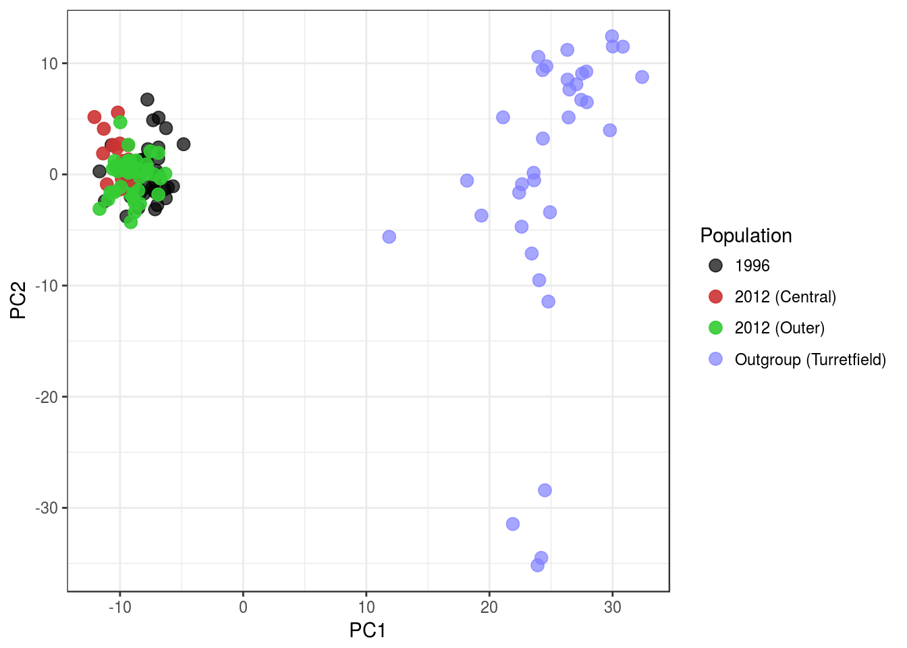
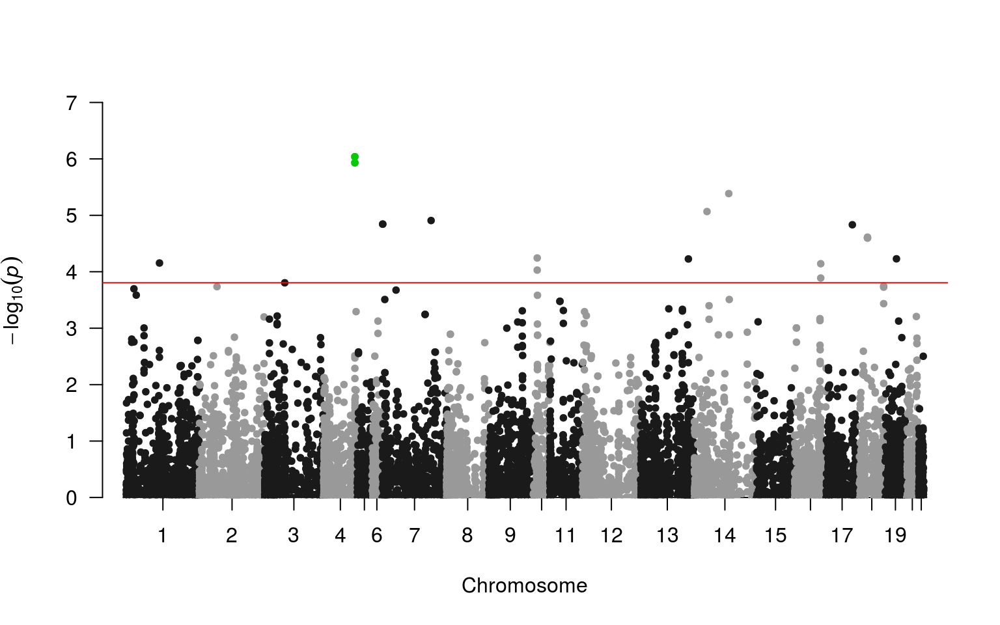

```r
library(tidyverse)
library(parallel)
library(pander)
library(scales)
library(reshape2)
library(readxl)
library(magrittr)
library(VennDiagram)
library(qqman)
library(sp)
library(ggmap)
```


```r
nCores <- min(12, detectCores() - 1)
logit <- binomial()$linkfun
alpha <- 0.05
theme_set(theme_bw())
```


# Introduction

This analysis takes the filtered SNPs from the [previous section](02_snpFiltering) and analyses their population frequencies amongst the two populations.
The two populations are referred to below as Population `1` (*Gum Creek*, 1996) and Population `2` (*Oraparinna*, 2012).

## Outline of analysis

The analysis uses two simple models fully described by Lewis in [Genetic association studies: Design, analysis and interpretation](https://doi.org/10.1093/bib/3.2.146) to detect statistically significant differences between the two populations

1. A *full genotype* model based on **genotype counts**, which will detect changes in the structure of heterozygous or homozygous nature of genotypes
2. A *multiplicative model* based on **allele counts** in which the impact of a single copy of an allele will be tested.

- Prior to analysis, PCA was performed as a data exploration procedure
- Models were tested using Fisher's Exact Test to allow for low counts in contingency tables
- Multiple testing adjustments were performed using both *Bonferroni's method* and the *Benjamini-Hochberg method* to assess results in the context of both FWER and FDR control.

# Data Setup


```r
allData <- file.path("..", "data", "filteredSNPs.tsv.gz") %>%
  gzfile() %>%
  read_delim(delim = "\t") 
```


```r
popSizes <- allData %>%
  group_by(`Pop ID`) %>%
  summarise(N = max(N)) %>%
  mutate(Population = c("1996", "2012")[`Pop ID`],
         Description = c("Gum Creek", "Oraparinna")[`Pop ID`]) %>%
  ungroup() %>%
  dplyr::select(contains("Pop"), Description, N)
```

Data from the 20,336 SNPs selected for testing was loaded, and sample sizes formed as a simple table.
Using the observed major allele frequencies (`P`) and heterozygote frequencies (`Obs Het`), the allele frequency and genotype frequency tables were constructed.


```r
allCounts <- allData %>%
  mutate(A = round(P*2*N, 0), 
         B = round((1-P)*2*N, 0), 
         AB = round(`Obs Het`*N, 0), 
         AA = round((A - AB)/2, 0), 
         BB = round((B - AB)/2, 0)) %>%
  dplyr::select(snpID, `Pop ID`, A, B, AA, AB, BB)
```

The complete set of minor allele counts derived from the original genepop file was also loaded


```r
minorAlleleCounts <- file.path("..", "data", "minorAlleleCounts.tsv.gz") %>%
  gzfile() %>%
  read_tsv() %>%
  as.data.frame() %>%
  column_to_rownames("sampleID") %>%
  as.matrix()
```

Populations are defined by the sample names in this object were also defined.


```r
allelePops <- gsub("(gc|ora|TF|Y|pt|tf).+", "\\1", rownames(minorAlleleCounts))
allelePops[!allelePops %in% c("gc", "ora")] <- "tf"
allelePops <- as.factor(allelePops)
names(allelePops) <- rownames(minorAlleleCounts)
```

In addition, the metadata from 2012 sample collection was loaded.


```r
sampleMetadata <- file.path("..", "data", "Samples_Nov2012_GumCreek.xlsx") %>%
  read_excel(skip = 1) %>%
  mutate(ID = gsub("[Oo][Rr][Aa] ", "ora", ID))
```

GPS Locations were added to the metadata.


```r
gpsPoints <-file.path("..", "data", "GPS_Locations.xlsx") %>%
  read_excel() %>%
  dplyr::select(ID = Sample, ends_with("tude")) %>%
  mutate(ID = gsub("[Oo][Rr][Aa] ([0-9ABC]*)", "ora\\1", ID))
sampleMetadata %<>% left_join(gpsPoints, by = "ID")
```


# Principal Component Analysis

## Missing Values

In order to perform PCA, missing values must be either imputed or the entire sample/SNPs must be removed.


```r
missingBySample <- minorAlleleCounts %>%
  apply(MARGIN = 1, function(x){mean(is.na(x))}) 
```

8 samples were missing information for more than 1/3 of SNPs and for the purposes of PCA, these samples were removed from the dataset.


```r
missingByAllele <- minorAlleleCounts %>%
  extract(missingBySample <= 1/3,) %>%
  apply(MARGIN = 2, function(x){mean(is.na(x))}) 
```

Of these remaining samples 9261 alleles were identified in >95% of individuals, and this subset of the data was then chosen as the basis for PCA.


```r
dataForPCA <- minorAlleleCounts[missingBySample <= 1/3, missingByAllele < 0.05]
```

Missing values were then randomly sampled using the distribution of alleles in the remaining samples.
Population structure was not taken into account at this point so as to not artificially inflate correlations within populations.


```r
dataForPCA %<>%
  apply(MARGIN = 2, function(x){
    missing <- is.na(x)
    if (sum(missing) > 0) {
      x[missing] <- sample(x[!missing], sum(missing),replace = TRUE)
    }
    x
  })
```

After this process it was noted that there was no allelic differences amongst the remaining samples for 2 SNPs, implying that the observed variants at these loci were contained within the samples with large numbers of missing data.
These loci were also removed before performing PCA.


```r
dataForPCA %<>% extract(, apply(., MARGIN = 2, function(x){length(unique(x))}) > 1)
```


## PCA Including The Outgroup Samples


```r
set.seed(53)
outgroupPCA <- dataForPCA %>%
  prcomp(center = TRUE)
```

The two Gum Creek populations (1996 & 2012) clearly showed differences to the outgroup, however a strong "tail" was noted for some of the 2012 population along PC2.

The samples forming this tail (i.e. PC2 > 5 & PC3 < 0 ) were identified and the collection region for these samples was investigated, using the GPS collection point.
The vast majority were found to come from the central collection region, and this sub-population was added to the PCA plot.


```r
pcaForPlot <- outgroupPCA$x %>%
  as.data.frame() %>%
  rownames_to_column("sampleID") %>%
  as_data_frame() %>%
  dplyr::select(sampleID, PC1, PC2, PC3) %>%
  mutate(Population = allelePops[sampleID]) %>%
  rowwise() %>%
  mutate(Population = if_else(Population == "gc", "Gum Creek (1996)",
                              if_else(Population == "ora", "Oraparinna (2012)", "Turretfield (2010)"))) %>%
  left_join(sampleMetadata, by = c("sampleID" = "ID")) %>%
  mutate(Population = if_else(Population == "Oraparinna (2012)",
                              if_else(PC3 < 0 && PC2 > 5, "Oraparinna Central (2012)", "Oraparinna Outer (2012)" ), Population))
```


# Phylogenetic Analysis

## Data Export For Generation of Phylogenies

The SNP information for the original 20336 alleles was then exported for phylogenetic analysis.
The same subset of 135 samples was used for this analysis as was used for the PCA analysis above.


```r
alleles <- allData %>%
  dplyr::select(snpID, contains("Nuc")) %>%
  distinct(snpID, .keep_all = TRUE) %>%
  rowwise() %>%
  mutate(AA = paste0(`P Nuc`, `P Nuc`),
         AB = paste0(`P Nuc`, `Q Nuc`),
         BB = paste0(`Q Nuc`, `Q Nuc`)) %>%
  ungroup %>%
  dplyr::select(snpID, AA, AB, BB) %>%
  as.data.frame() %>%
  column_to_rownames("snpID") %>%
  as.matrix()
```


```r
gzOut <- file.path("..", "data", "snpForPhylo.tsv.gz") %>% gzfile("w")
colnames(minorAlleleCounts) %>% 
  vapply(function(x){
    alleles[x,  minorAlleleCounts[,x] + 1]
    }, character(nrow(minorAlleleCounts))) %>%
  as_data_frame() %>%
  mutate(sampleID = rownames(minorAlleleCounts)) %>%
  filter(sampleID %in% pcaForPlot$sampleID) %>%
  mutate(Population = gsub("gc.+", "Gum Creek (1996)", sampleID),
         Population = gsub("(TF|Y|pt|tf).+", "Turretfield (2010)", Population),
         Population = ifelse(sampleID %in% filter(pcaForPlot, grepl("Central", Population))$sampleID,
                             "Oraparinna Central (2012)", Population),
         Population = gsub("ora.+", "Oraparinna Outer (2012)", Population),
         colour = ifelse(grepl("Turretfield", Population), rgb(0.5, 0.5, 1, 0.7), ""),
         colour = ifelse(grepl("Gum", Population), rgb(0, 0, 0, 0.7), colour),
         colour = ifelse(grepl("Central", Population), rgb(0.8, 0.2, 0.2, 0.9), colour),
         colour = ifelse(grepl("Outer", Population), rgb(0.2, 0.8, 0.2, 0.9), colour)) %>%
  dplyr::select(sampleID, Population, colour, everything()) %>%
  write_tsv(gzOut)
close(gzOut)
```


# Analysis

## Removal of SNPs Associated with Collection Region

The structure observed within the 2012 population in the PCA could possibly be explained by recent migration into this region.
As the samples collected in the outer regions appeared very similar to the 1996 population in the above plots, this would possibly indicate this a very recent event as the genetic influence of this has not spread through the wider area.
Although this may be due to other factors such as sampling bias, this structure was addressed by identifying SNPs which showed an association with the sub-populations identified by PCA analysis.
In this way, any candidate SNPs obtained below will be less impacted by this structure, and will be more reflective of the intended variable under study, as opposed to any internal structure of the 2012 population.


```r
oraRegions <- pcaForPlot %>% 
  filter(grepl("2012", Population)) %>% 
  mutate(Central = grepl("Central", Population)) %>% 
  dplyr::select(sampleID, Central) %>%
  as.data.frame() %>%
  column_to_rownames("sampleID") 
```


### Testing for Structure in 2012

This model tests:  
H<sub>0</sub>: No association between genotypes and collection region  
H<sub>A</sub>: An association exists between genotypes and collection region


```r
ora <- grep("ora", rownames(minorAlleleCounts), value = TRUE)
regionResults <- minorAlleleCounts %>%
  extract(ora,) %>%
  apply(MARGIN = 2, function(x){
    mat <- table(oraRegions[ora, "Central"], x)
    if (ncol(mat) > 1){
      fisher.test(mat)$p.value
    }
    else{
      NA
    }
  })
```

A total of 2454 SNPs were detected as showing a significant association between genotype and the collection region.
Under H<sub>0</sub>, the number expected using &#945; = 0.05 would be 1016, and as this number was approximately double that expected, this was taken as evidence of this being a genuine point of concerning this data.

Type II errors were of principle concern in this instance, and as such every SNP with p < 0.05 in the above test was excluded from downstream analysis.


```r
regionSNPs <- names(which(regionResults < 0.05))
regionSNPs %>% writeLines(file.path("..", "results", "regionSNPs.txt"))
```

Under this additional filtering step, **the original set of 20336 SNPs will be reduced to 17882** for testing by genotype and allele frequency.


### Verification Of Removal

In order to verify that the removal of the above SNPs removed the undesired population structure from the 2012 population, the above PCA was repeated, excluding the SNPs marked for removal.
The previous structure noted in the data was no longer evident, and as such, these SNPs were marked for removal during analysis by genotype and allele frequency. 


```r
reducedPCA <- dataForPCA %>%
  extract(, !colnames(.) %in% regionSNPs) %>%
  prcomp()
```




## Genotype Frequency Model

This model tests:  
H<sub>0</sub>: No association between genotypes and populations  
H<sub>A</sub>: An association exists between genotypes and populations


```r
genotypeResults <- allCounts %>%
  filter(!snpID %in% regionSNPs) %>%
  split(f = .$snpID) %>%
  mclapply(function(x){
    mat <- as.matrix(x[,c("AA", "AB",  "BB")])
    ft <- fisher.test(mat)
    data_frame(snpID = unique(x$snpID),
               p = ft$p.value)
  }, mc.cores = nCores) %>%
  bind_rows() %>%
  mutate(adjP = p.adjust(p, method = "bonferroni"),
         FDR = p.adjust(p, method = "fdr")) %>%
  arrange(p)
```


Under the full genotype model:

- 0 genotypes were detected as being significantly associated with the two populations when controlling the FWER at &#945; = 0.05
- 0 genotypes were detected as being significantly associated with the two populations when controlling the FDR at &#945; = 0.05
- If controlling the FDR at 10% however, a total of 26 genotypes were considered as potentially associated with the population structure 
- For the most highly ranked SNP (147965_18), the minor allele has been completely lost in the 2012 population


|      Chr |          BP | snpID     |         p |     FDR |
|---------:|------------:|:----------|----------:|--------:|
|        7 | 131,862,327 | 147965_18 | 6.312e-06 | 0.08094 |
|        5 |  12,946,260 | 158509_87 | 1.365e-05 | 0.08094 |
|       20 |  14,022,385 | 64526_24  | 1.384e-05 | 0.08094 |
|       13 | 125,904,892 | 104906_36 | 1.811e-05 | 0.08094 |
|       14 |  34,667,589 | 98522_63  | 2.712e-05 |  0.0817 |
|       14 |  92,793,012 | 101831_18 | 2.741e-05 |  0.0817 |
|       18 |  25,311,139 | 72765_47  | 4.157e-05 | 0.09292 |
|       18 |  25,311,176 | 72766_17  | 4.157e-05 | 0.09292 |
|       18 |  25,311,153 | 72765_61  | 5.227e-05 | 0.09563 |
| GL018754 |   1,365,061 | 37345_16  | 5.665e-05 | 0.09563 |
|       17 |  69,838,525 | 80772_39  | 8.448e-05 | 0.09563 |
|        2 |  47,053,622 | 185586_34 | 8.657e-05 | 0.09563 |
|        7 |  38,250,131 | 151791_54 | 9.501e-05 | 0.09563 |
|        7 |   2,702,916 | 151249_77 | 9.629e-05 | 0.09563 |
|        7 |   2,702,919 | 151251_13 | 9.629e-05 | 0.09563 |
| GL018881 |      88,327 | 233206_29 | 9.849e-05 | 0.09563 |
| GL018754 |   1,395,711 | 37350_8   |     1e-04 | 0.09563 |

Table: SNPs with raw p-values < 1e-04 when analysing by genotype. All SNPs were considered significant using an FDR < 0.1


## Allele Frequency Model

This model tests:  
H<sub>0</sub>: No association between allele frequencies and populations  
H<sub>A</sub>: An association exists between allele frequencies  and populations


```r
alleleResults <- allCounts %>%
  filter(!snpID %in% regionSNPs) %>%
  split(f = .$snpID) %>%
  mclapply(function(x){
    mat <- as.matrix(x[,c("A", "B")])
    ft <- fisher.test(mat)
    data_frame(snpID = unique(x$snpID),
               p = ft$p.value)
  }, mc.cores = nCores) %>%
  bind_rows() %>%
  mutate(adjP = p.adjust(p, method = "bonferroni"),
         FDR = p.adjust(p, method = "fdr")) %>%
  arrange(p)
```

Under this model:

- 2 SNP alleles were detected as being significantly associated with the two populations when controlling the FWER at &#945; = 0.05.
However, as these SNPs were within 21nt of each other, this may represent the same haplotype 
- 14 SNP alleles were detected as being significantly associated with the two populations when controlling the FDR at &#945; = 0.05
- extending the FDR to 10% yielded 27 SNP alleles


|      Chr |          BP | snpID     |         p |    adjP |     FDR |
|---------:|------------:|:----------|----------:|--------:|--------:|
|        4 |  84,940,235 | 167108_14 | 9.143e-07 | 0.01635 | 0.01045 |
|        4 |  84,940,214 | 167107_60 | 1.169e-06 | 0.02091 | 0.01045 |
|       14 |  92,793,012 | 101831_18 | 4.112e-06 | 0.07354 | 0.02002 |
| GL018713 |     365,938 | 50206_34  | 4.478e-06 | 0.08008 | 0.02002 |
|       14 |  34,667,589 | 98522_63  | 8.562e-06 |  0.1531 | 0.02492 |
|        7 | 131,862,327 | 147965_18 | 1.235e-05 |  0.2209 | 0.02492 |
| GL018881 |      88,327 | 233206_29 | 1.266e-05 |  0.2263 | 0.02492 |
|        7 |   2,702,916 | 151249_77 | 1.431e-05 |  0.2558 | 0.02492 |
|        7 |   2,702,919 | 151251_13 | 1.431e-05 |  0.2558 | 0.02492 |
|       17 |  69,838,525 | 80772_39  | 1.468e-05 |  0.2624 | 0.02492 |
| GL018704 |   4,853,505 | 53831_42  | 1.533e-05 |  0.2741 | 0.02492 |
|       18 |  25,311,153 | 72765_61  | 2.434e-05 |  0.4352 | 0.03222 |
|       18 |  25,311,139 | 72765_47  | 2.523e-05 |  0.4511 | 0.03222 |
|       18 |  25,311,176 | 72766_17  | 2.523e-05 |  0.4511 | 0.03222 |

Table: SNPs considered as significant when analysing by genotype using an FDR cutoff of 0.05




## FLK Analysis

The FLK analysis performed separately was also included in order to compare the differing approaches.
It should be noted that this analytic approach is very closely related to analysis by allele frequency, however, instead of Fisher's Exact Test a Chi-squared model is utilised incorporating genetic distances to ccount for genetics drift.


```r
flkResults <- file.path("..", "results", "flkResults.tsv") %>%
  read_tsv()
```

## Bayescan Analysis


```r
snpsForBayescan <- file.path("..", "data", "filteredSNPs.genepop.gz") %>%
  gzfile() %>%
  readLines(n = 2) %>%
  extract2(2) %>%
  strsplit(",") %>%
  extract2(1)
```

The analysis tool Bayescan was also run on the set of 20,336 SNPs exported as a `genepop` file after the previous filtering steps.
The program was run using an FDR of 0.05 with an additional run setting the FDR to 0.1.
Any SNPs detected above as tracking with the internal structure of the 2012 population were discarded from the results.


```r
bayes05 <- file.path("..", "results", "BayOut_FDR5.csv") %>%
  read_csv() %>%
  mutate(snpID = snpsForBayescan[SNP]) %>%
  dplyr::select(snpID, everything(), -SNP) %>%
  filter(!snpID %in% regionSNPs)
```


```r
bayes10 <- file.path("..", "results", "BayOut_FDR10.csv") %>%
  read_csv() %>%
  mutate(snpID = snpsForBayescan[SNP])%>%
  dplyr::select(snpID, everything(), -SNP) %>%
  filter(!snpID %in% regionSNPs)
```

## Comparison of Results


```r
fdr <- c(genotype = 0.1, allele = 0.05, flk = 0.05)
sigSNPs <- c(filter(genotypeResults,FDR < fdr["genotype"])$snpID,
             filter(alleleResults, FDR < fdr["allele"])$snpID,
             filter(flkResults, FDR < fdr["flk"])$snpID,
             bayes10$snpID) %>%
  unique %>%
  as.data.frame() %>%
  set_names("snpID") %>%
  mutate(genotype = snpID %in% filter(genotypeResults,FDR < fdr["genotype"])$snpID,
         allele = snpID %in% filter(alleleResults,FDR < fdr["allele"])$snpID,
         flk = snpID %in% filter(flkResults, FDR < fdr["flk"])$snpID,
         bayes = snpID %in% bayes10$snpID)
```

- It was noted when comparing results from FLK and analysis by allele frequency alone that all SNPs from the allele frequency analysis were detected by either FLK or the genotpe analysis.
As such this analysis was disregarded going forward.
- Similarly, no novel SNPs were detected by Bayescan, and all in the list down to an FDR of 0.1 were included in either the analysis using FLK or the full genotypes.
As such, the Bayescan analysis was also disregarded going forward.


### SNPs Associated With Populations Under Both Approaches

The list of SNPs detected as associated with the population structure under both FLK and analysis by genotype is given below.


| snpID     | Chr      |          BP | Change in log(OR) | P_1996 | P_2012 | Genotype_p |     FLK_p |
|:----------|:---------|------------:|------------------:|-------:|-------:|-----------:|----------:|
| 127156_20 | 10       |  14,373,457 |            -1.291 |    0.5 | 0.2157 |  0.0001159 | 8.942e-05 |
| 104906_36 | 13       | 125,904,892 |            -1.492 | 0.9302 |   0.75 |  1.811e-05 | 4.988e-05 |
| 98522_63  | 14       |  34,667,589 |            -1.897 | 0.9375 | 0.6923 |  2.712e-05 | 6.373e-08 |
| 80772_39  | 17       |  69,838,525 |             1.584 | 0.5952 | 0.8776 |  8.448e-05 | 5.139e-05 |
| 72765_47  | 18       |  25,311,139 |            -1.417 | 0.8333 | 0.5481 |  4.157e-05 | 2.369e-06 |
| 72765_61  | 18       |  25,311,153 |            -1.413 | 0.8333 |  0.549 |  5.227e-05 | 2.541e-06 |
| 72766_17  | 18       |  25,311,176 |            -1.417 | 0.8333 | 0.5481 |  4.157e-05 | 2.369e-06 |
| 68946_78  | 19       |  32,825,478 |            -1.547 | 0.9062 | 0.6731 |  0.0001032 | 3.433e-06 |
| 204810_79 | GL018802 |     439,482 |            -1.836 | 0.9583 | 0.7857 |  0.0001362 | 6.111e-06 |
| 233206_29 | GL018881 |      88,327 |             1.466 | 0.5357 | 0.8333 |  9.849e-05 | 3.363e-05 |

Table: Summary of changes in the major (P) allele between the two timepoints. Changes in the log Odds ratio of observing the major allele are given, along with estimated population frequencies. Results from testing by genotype or FLK are given as raw p-values. All SNPs were considered as differentially associated with the two populations under both analyses to an FDR of 10\% (genotype) or 5\% (FLK)


### SNPs Associated With Populations Under Analysis Using FLK Only


| Chr      | BP          |     snpID | Change in log(OR) | P_1996 | P_2012 |     FLK_p |
|:---------|:------------|----------:|------------------:|-------:|-------:|----------:|
| 1        | 20,066,891  | 195917_31 |            -1.181 | 0.7442 | 0.4717 | 5.149e-05 |
| 1        | 88,290,774  | 200447_80 |            -1.354 |   0.86 | 0.6132 |  1.39e-05 |
| 10       | 14,373,501  | 127157_45 |            -1.266 |    0.5 |   0.22 | 0.0001145 |
| 10       | 15,010,006  | 127237_21 |            -1.303 | 0.8333 | 0.5761 | 1.765e-05 |
| 11       | 36,239,538  |  123550_8 |            -1.427 | 0.9091 | 0.7059 | 3.233e-05 |
| 11       | 36,239,606  | 123551_30 |            -1.317 | 0.8864 | 0.6765 | 6.409e-05 |
| 13       | 15,938,245  | 107422_35 |            -2.351 | 0.9881 | 0.8878 | 6.571e-05 |
| 13       | 7.6e+07     | 111958_69 |            -1.341 | 0.8958 | 0.6923 | 6.507e-05 |
| 13       | 128,331,083 | 105215_39 |            -1.199 | 0.6304 | 0.3396 | 5.535e-05 |
| 16       | 735,716     |  87819_88 |            -2.016 | 0.9762 | 0.8452 | 2.811e-05 |
| 16       | 69,850,541  |  87407_11 |            -1.183 |   0.62 | 0.3333 | 7.397e-05 |
| 18       | 68,517,919  | 208110_71 |            -1.304 | 0.8478 |  0.602 | 2.381e-05 |
| 18       | 68,517,942  | 208111_21 |            -1.312 | 0.8478 |    0.6 | 2.064e-05 |
| 2        | 93,561,889  | 214772_69 |            -2.607 | 0.9898 | 0.8774 | 9.255e-06 |
| 21       | 14,643,101  |  62998_77 |            -2.474 | 0.9889 | 0.8824 | 2.511e-05 |
| 3        | 53,556,574  | 175501_56 |            -1.324 | 0.8796 | 0.6604 | 4.414e-05 |
| 4        | 84,940,214  | 167107_60 |             1.987 | 0.6354 | 0.9271 | 1.564e-05 |
| 4        | 84,940,235  | 167108_14 |             1.997 | 0.6383 | 0.9286 |  1.64e-05 |
| 7        | 8,307,536   | 154818_20 |            -1.427 | 0.9135 |  0.717 | 4.198e-05 |
| 9        | 89,862,459  | 211772_50 |            -1.807 | 0.9535 | 0.7708 | 4.259e-06 |
| 9        | 89,862,481  | 211772_28 |            -1.627 | 0.9432 | 0.7653 | 2.053e-05 |
| 9        | 89,862,497  | 211772_12 |            -1.596 | 0.9432 | 0.7708 | 3.351e-05 |
| 9        | 90,037,571  | 137949_40 |             -1.78 | 0.9667 | 0.8302 | 7.017e-05 |
| 9        | 90,037,630  | 137951_16 |            -1.803 | 0.9674 | 0.8302 | 5.925e-05 |
| GL018704 | 4,853,505   |  53831_42 |            -1.346 | 0.7045 |  0.383 | 4.169e-06 |
| GL018713 | 365,938     |  50206_34 |            -1.533 | 0.7857 | 0.4419 | 1.472e-07 |
| GL018717 | 314,346     |  48659_40 |            -1.471 | 0.8571 | 0.5795 | 1.555e-06 |
| GL018723 | 261,534     | 235050_26 |            -2.152 | 0.9773 | 0.8333 | 5.513e-06 |
| GL018723 | 266,003     | 206301_14 |            -2.047 | 0.9792 | 0.8585 | 4.882e-05 |
| GL018739 | 75,851      |  41475_63 |            -1.232 | 0.7273 | 0.4375 | 2.309e-05 |
| GL018761 | 75,552      |  36037_47 |            -2.377 | 0.9894 | 0.8962 | 0.0001096 |
| GL018878 | 365,646     | 218710_78 |            -1.214 | 0.6667 | 0.3725 | 3.554e-05 |
| GL019002 | 95,028      |  14915_82 |            -1.233 | 0.7955 | 0.5312 | 3.191e-05 |
| GL019406 | 5,672       |    5908_8 |            -1.657 |   0.96 | 0.8208 | 0.0001212 |

Table: Summary of changes in the major (P) allele between the two timepoints. Changes in the log Odds ratio of observing the major allele are given, along with estimated population frequencies. Results from testing by allele count are given as raw p-values. All SNPs were considered as differentially associated with the two populations under FLK analysis to an FDR of 5\%.


### SNPs Associated With Populations Under Analysis By Genotype Only


| Chr      | BP          |     snpID | Change in log(OR) | P_1996 | P_2012 | Genotype_p |
|:---------|:------------|----------:|------------------:|-------:|-------:|-----------:|
| 14       | 92,793,012  | 101831_18 |            -2.253 | 0.3778 |   0.06 |  2.741e-05 |
| 18       | 14,288,883  |  72030_54 |            -1.408 | 0.7347 | 0.4038 |  0.0001334 |
| 2        | 37,519,845  |  184763_8 |                -2 | 0.4348 | 0.0943 |  0.0001431 |
| 2        | 47,053,622  | 185586_34 |            -2.611 | 0.3571 | 0.0392 |  8.657e-05 |
| 20       | 14,022,385  |  64526_24 |            -1.971 | 0.7391 |  0.283 |  1.384e-05 |
| 5        | 12,946,260  | 158509_87 |             3.324 | 0.6429 | 0.9804 |  1.365e-05 |
| 7        | 2,702,916   | 151249_77 |            -2.091 | 0.3269 | 0.0566 |  9.629e-05 |
| 7        | 2,702,919   | 151251_13 |            -2.091 | 0.3269 | 0.0566 |  9.629e-05 |
| 7        | 38,250,131  | 151791_54 |            -2.582 | 0.3462 | 0.0385 |  9.501e-05 |
| 7        | 131,862,327 | 147965_18 |              -Inf | 0.3043 |      0 |  6.312e-06 |
| 9        | 48,543,229  | 134595_50 |             1.541 | 0.3061 | 0.6731 |   0.000107 |
| GL018754 | 1,365,061   |  37345_16 |            -1.453 | 0.7111 | 0.3654 |  5.665e-05 |
| GL018754 | 1,395,679   |  37349_74 |             -1.34 | 0.6939 | 0.3725 |  0.0001063 |
| GL018754 | 1,395,711   |   37350_8 |            -1.369 |    0.7 | 0.3725 |      1e-04 |
| GL018758 | 1,220,835   |  36566_45 |            -1.055 | 0.5962 | 0.3396 |  0.0001331 |
| GL018758 | 1,220,869   |  36567_12 |            -1.055 | 0.5962 | 0.3396 |  0.0001331 |

Table: Summary of changes in heterozygosity between the two timepoints. Changes in the log Odds ratio of observing heterozygotes are given, along with estimated population-level heterozygote frequencies. Results from testing by genotype count are given as raw p-values. All SNPs were considered as differentially associated with the two populations under the genotype count analysis to an FDR of 10\%, However, no significant changes in allele frequencies were detected using an FDR of 5\% for FLK analysis.


# Output

Both sets of results were output as `genotypeResults.tsv` and `alleleResults.tsv`


```r
alleleResults %>% 
  left_join(allData) %>% 
  distinct(snpID, .keep_all = TRUE) %>% 
  dplyr::select(snpID, Chr, BP, p, adjP, FDR) %>%
  write_tsv(file.path("..", "results", "alleleResults.tsv"))
```

```r
genotypeResults %>% 
  left_join(allData) %>% 
  distinct(snpID, .keep_all = TRUE) %>% 
  dplyr::select(snpID, Chr, BP, p, adjP, FDR) %>%
  write_tsv( file.path("..", "results", "genotypeResults.tsv"))
```


**R version 3.4.3 (2017-11-30)**

**Platform:** x86_64-pc-linux-gnu (64-bit) 

**locale:**
_LC_CTYPE=en_AU.UTF-8_, _LC_NUMERIC=C_, _LC_TIME=en_AU.UTF-8_, _LC_COLLATE=en_AU.UTF-8_, _LC_MONETARY=en_AU.UTF-8_, _LC_MESSAGES=en_AU.UTF-8_, _LC_PAPER=en_AU.UTF-8_, _LC_NAME=C_, _LC_ADDRESS=C_, _LC_TELEPHONE=C_, _LC_MEASUREMENT=en_AU.UTF-8_ and _LC_IDENTIFICATION=C_

**attached base packages:** 
_grid_, _parallel_, _stats_, _graphics_, _grDevices_, _utils_, _datasets_, _methods_ and _base_

**other attached packages:** 
_bindrcpp(v.0.2)_, _ggmap(v.2.6.1)_, _sp(v.1.2-5)_, _qqman(v.0.1.4)_, _VennDiagram(v.1.6.18)_, _futile.logger(v.1.4.3)_, _magrittr(v.1.5)_, _readxl(v.1.0.0)_, _reshape2(v.1.4.2)_, _scales(v.0.5.0)_, _pander(v.0.6.1)_, _forcats(v.0.2.0)_, _stringr(v.1.2.0)_, _dplyr(v.0.7.4)_, _purrr(v.0.2.4)_, _readr(v.1.1.1)_, _tidyr(v.0.7.2)_, _tibble(v.1.3.4)_, _ggplot2(v.2.2.1)_ and _tidyverse(v.1.2.1)_

**loaded via a namespace (and not attached):** 
_Rcpp(v.0.12.14)_, _lubridate(v.1.7.1)_, _lattice(v.0.20-35)_, _png(v.0.1-7)_, _assertthat(v.0.2.0)_, _rprojroot(v.1.2)_, _digest(v.0.6.12)_, _psych(v.1.7.8)_, _R6(v.2.2.2)_, _cellranger(v.1.1.0)_, _plyr(v.1.8.4)_, _futile.options(v.1.0.0)_, _backports(v.1.1.1)_, _evaluate(v.0.10.1)_, _httr(v.1.3.1)_, _highr(v.0.6)_, _RgoogleMaps(v.1.4.1)_, _rlang(v.0.1.4)_, _lazyeval(v.0.2.1)_, _rstudioapi(v.0.7)_, _geosphere(v.1.5-7)_, _rmarkdown(v.1.8)_, _proto(v.1.0.0)_, _labeling(v.0.3)_, _foreign(v.0.8-69)_, _munsell(v.0.4.3)_, _broom(v.0.4.3)_, _compiler(v.3.4.3)_, _modelr(v.0.1.1)_, _pkgconfig(v.2.0.1)_, _mnormt(v.1.5-5)_, _htmltools(v.0.3.6)_, _calibrate(v.1.7.2)_, _crayon(v.1.3.4)_, _nlme(v.3.1-131)_, _jsonlite(v.1.5)_, _gtable(v.0.2.0)_, _cli(v.1.0.0)_, _stringi(v.1.1.6)_, _mapproj(v.1.2-5)_, _xml2(v.1.1.1)_, _rjson(v.0.2.15)_, _lambda.r(v.1.2)_, _tools(v.3.4.3)_, _glue(v.1.2.0)_, _maps(v.3.2.0)_, _hms(v.0.4.0)_, _jpeg(v.0.1-8)_, _yaml(v.2.1.15)_, _colorspace(v.1.3-2)_, _rvest(v.0.3.2)_, _knitr(v.1.17)_, _bindr(v.0.1)_ and _haven(v.1.1.0)_

