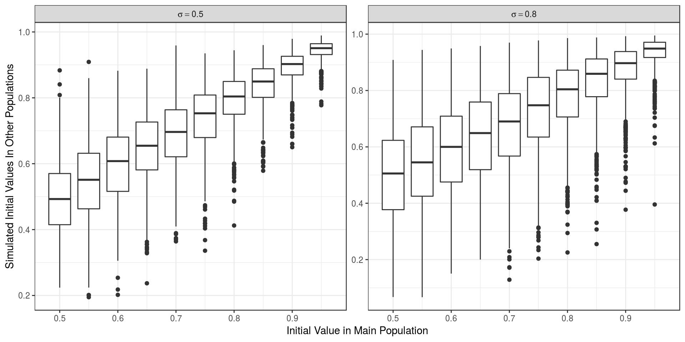

```r
library(pander)
library(magrittr)
library(dplyr)
library(scales)
library(ggplot2)
library(parallel)
library(readr)
```


```r
logit <- binomial()$linkfun
inv.logit <- binomial()$linkinv
```

# Introduction

This analysis takes the filtered SNPs from under analysis and simulates genetic drift under no selective pressure, in order to compare detected changes in allele frequencies to the range of values predicted by the drift model.

## Outline of Drift Simulation

This analysis uses a custom set of scripts collected as an R package and available from https://github.com/steveped/driftSim.
This is able to be installed as below.


```r
devtools::install_github("steveped/driftSim")
library(driftSim)
```

### Initialisation


```r
nGen <- 16
nSim <- 5000
litterSize <- 30
migRate <- 0.15
alpha <- 0.001
Ne <- c(`1996` = 222, `2012` = 116)
pSurv <- 0.1
f0 <- seq(0.5, 0.95, by = 0.05)
nPops <- c(4, 8)
sigma <- c(0.5, 0.8)
```


As decided the population parameters were defined as:

| Parameter   | Value          | Comment                                                     |
|:----------- |:-------------- |:----------------------------------------------------------- |
| *Ne*~1996~  | 222 | Effective Population Size in 1996                           |
| *Ne*~2012~  | 116 | Effective Population Size in 2012                           |
| *p*         | 0.1      | Probability of survival after initial outbreak              |
| *g*         | 16       | The number of generations between 1996 and 2012             |
| *n*         | 4, 8      | The number of neighbouring populations                      |
| *l*         | 30 | The annual litter size                                      |
| *r*         | 0.15    | The migration rate                                          |
| *f~0~*      | 0.5 to 0.95    | The starting allele frequency, increased in steps of 0.05  |
| *&sigma;*   | 0.5, 0.8      | The initial variability in *f~0~* in neighbouring populations |

No selective advantage was specified for any allele.

The simulation parameters were defined as:

| Parameter   | Value     | Comment                                                     |
|:----------- |:--------- |:----------------------------------------------------------- |
| *n*~sim~    | 5000  | The number of simulations at each starting frequency *f~0~* |
| *&alpha;*   | 0.001 | The significance level for plotting confidence bands        |


To summarise the above:

1. The effective population size was defined as Ne = 222 representing the initial population in 1996. 
2. A starting major allele frequency was selected as one of *f~0~* = _0.5_, _0.55_, _0.6_, _0.65_, _0.7_, _0.75_, _0.8_, _0.85_, _0.9_ and _0.95_. Each rabbit was simulated as heterozygous or homozygous for either the major or minor allele using the initial starting frquency
3. An initial survival rate was defined as p = 0.1, with this functioning as an initial bottleneck, and rabbits were assigned as survivors or fatalities with this probability.
4. This population was considered as the *central population*, and this initialisation process was then repeated for either 4 or 8 neighbouring populations of the same size. However, variability was added to the initial allele frequencies on the logit scale using values of *&sigma;* = _0.5_ and _0.8_. The same bottleneck procedure was applied to each of these populations.


# Placing Variability in Context


```r
nSamp <- 1e06
x_0 <- runif(nSamp, 0.5, 0.95)
y_0 <- sigma %>%
  lapply(function(sigma){
    inv.logit(rnorm(nSamp, logit(x_0), sigma))
  })
```


In order to express these values for *&sigma;* in terms of correlations, 1,000,000 random values were simulated for a starting frequency (*f~0~*) anywhere between 0.5 and 0.95.
1,000,000 _neighbouring population starting values_ were randomly sampled around this using the values of *&sigma;* = _0.5_ and _0.8_, with the random sampling taking place on the logit scale.





In order to express these values for *&sigma;* in terms of correlations, 1,000,000 random values were simulated for a starting frequency (*f~0~*) anywhere between 0.5 and 0.95.
1,000,000 _neighbouring population starting values_ were randomly sampled around this using the values of *&sigma;* = _0.5_ and _0.8_, with the random sampling taking place on the logit scale.


| Sigma | Correlation |
|:-----:|:-----------:|
|  0.5  |    0.81     |
|  0.8  |    0.65     |

Table: Approximate correlations between starting allele frequencies in two populations, for three chosen values of $\sigma$


# Run Simulations


```r
allParam <- expand.grid(f0 = f0,
                        mig = migRate,
                        n = nPops,
                        sd = sigma) %>%
  mutate(N0 = round(Ne["1996"], 0),
         Nt = round(Ne["2012"], 0),
         t = nGen,
         surv = pSurv,
         litter = litterSize) %>%
  split(f = factor(1:nrow(.)))
```


```r
allSim <- allParam %>%
  mclapply(function(x){
    x <- as.list(x)
    replicate(nSim, do.call(simDrift, args = x)$ft)
  },
  mc.cores = 20)
```


```r
allSim99 <- allSim %>%
  lapply(quantile, probs = c(alpha/2, 1-alpha/2)) %>%
  lapply(as.list) %>%
  lapply(as.data.frame) %>%
  bind_rows() %>%
  set_names(c("lwr", "upr"))
```


```r
driftIntervals <- allParam %>%
  bind_rows() %>%
  dplyr::select(f0, n, sd) %>%
  as_data_frame() %>%
  cbind(allSim99)
```


Save here for now to run over the weekend


```r
save.image("../05_GeneticDrift.RData")
```

