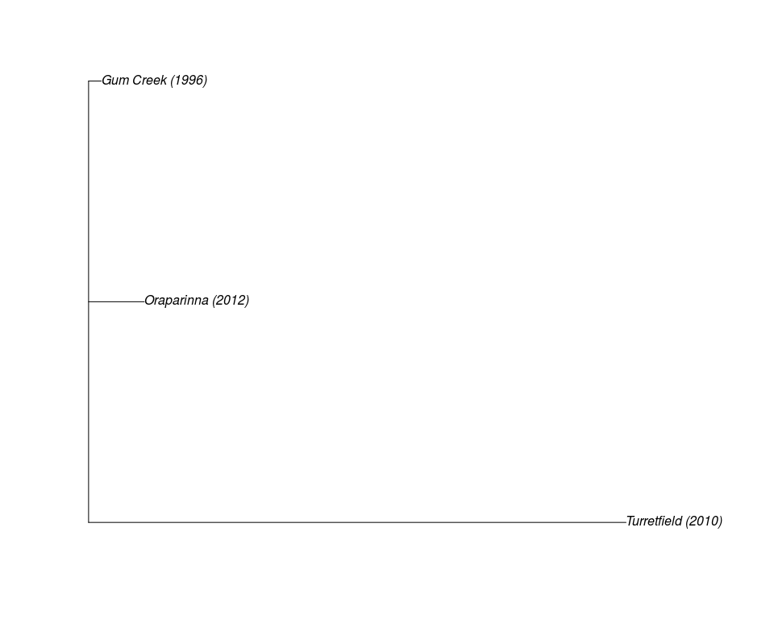
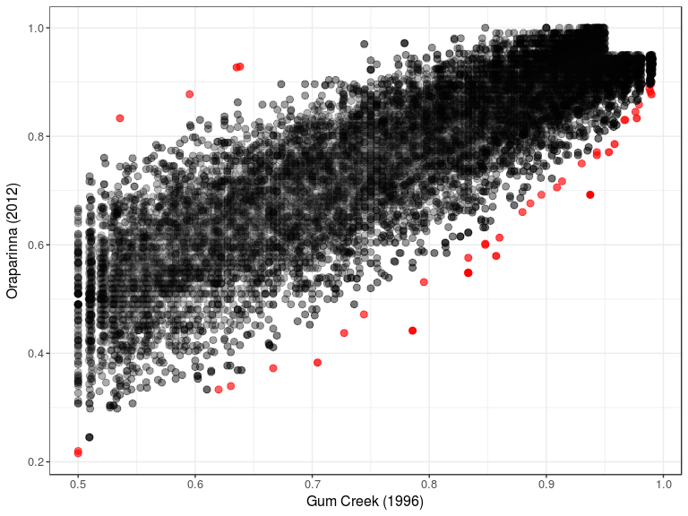

```r
library(tidyverse)
library(magrittr)
library(rtracklayer)
library(GenomicRanges)
library(parallel)
library(reshape2)
library(pander)
library(scales)
library(stringr)
```


```r
nCores <- min(12, detectCores() - 1)
```

# Introduction

This supplementary analysis uses the FLK model as outlined in [Bonhomme et al, Detecting Selection in Population Trees: The Lewontin and Krakauer Test Extended](https://dx.doi.org/10.1534%2Fgenetics.110.117275).
This test is robust to genetic drift, and is able to detect signatures of selection.
However as this is a linear evolution dataset within one population as opposed to a series of approximately parallel selection events occurring within a series of populations, the assumptions of the FLK model may be less than satisfied.
Hence this is presented as supplementary information.

A third population was included as an outlier group, representing a population separated by a large geographic distance. 35 samples were taken from [Schwensow et al]( http://onlinelibrary.wiley.com/doi/10.1111/mec.14228/full).

# Setup

## Genome & Genes

Whilst aligned to the RefSeq/NCBI genome build, for compatibility with Ensembl gene models, a mapping object was generated from the [RefSeq Assembly Report](ftp://ftp.ncbi.nih.gov/genomes/refseq/vertebrate_mammalian/Oryctolagus_cuniculus/latest_assembly_versions/GCF_000003625.3_OryCun2.0/GCF_000003625.3_OryCun2.0_assembly_report.txt)


```r
ncbiReport <- file.path("..", "data", "GCF_000003625.3_OryCun2.0_assembly_report.txt") %>%
  read_delim(delim = "\t", col_names = FALSE, na = "na", comment = "#") %>%
  set_colnames(c("Sequence-Name", "Sequence-Role", "Assigned-Molecule", "Assigned-Molecule-Location/Type", "GenBank-Accn", "Relationship", "RefSeq-Accn", "Assembly-Unit", "Sequence-Length", "UCSC-style-name")) %>%
  filter(!is.na(`RefSeq-Accn`))
ensUsesGB <- grepl("scaffold",ncbiReport$`Sequence-Role`)
ncbiReport$Ensembl <- ncbiReport$`Sequence-Name`
ncbiReport$Ensembl[ensUsesGB] <- gsub("\\.[0-9]$", "", ncbiReport$`GenBank-Accn`[ensUsesGB])
ncbi2Ens <- with(ncbiReport, data.frame(Chr = Ensembl, 
                                        Length = `Sequence-Length`,
                                        row.names = `RefSeq-Accn`))
```

Gene information was obtained from Ensembl Build 84 and loaded 


```r
ensGff <- file.path("..", "data", "Oryctolagus_cuniculus.OryCun2.0.84.gff3.gz")
ensGenes <- import.gff3(ensGff, feature.type = "gene", sequenceRegionsAsSeqinfo = TRUE) 
```


## Data Loading

The same stacks output as in [2_snpFiltering](2_snpFiltering.md) was loaded, retaining data from the third population (Turretfield).


```r
allData <- file.path("..", "data", "batch_3.sumstats.tsv.gz") %>%
  gzfile() %>%
  read_delim(delim = "\t", col_names = TRUE, skip = 3) %>%
  dplyr::select(-contains("Batch"), -contains("Pi"), -contains("Fis")) %>%
  mutate(RefSeq = gsub("^gi\\|.+\\|ref\\|(.+)\\|$", "\\1", Chr),
         Chr = as.character(ncbi2Ens[RefSeq, "Chr"]),
         snpID = paste(`Locus ID`, Col, sep="_"),
         Private = as.logical(Private)) %>%
  filter(Chr != "X",
         Col > 4) %>%
  dplyr::select(Chr, BP, `Locus ID`, Col, snpID, 
                `Pop ID`, contains("Nuc"),  N, P, 
                contains("Obs"), contains("Exp"), Private)
```


```r
allSnpsGR <- allData %>%
  distinct(snpID, .keep_all = TRUE) %>%
  makeGRangesFromDataFrame(ignore.strand = TRUE,
                           keep.extra.columns = TRUE,
                           seqinfo = seqinfo(ensGenes), 
                           seqnames.field = "Chr", 
                           start.field = "BP", 
                           end.field = "BP") %>%
  sort()
mcols(allSnpsGR) <- DataFrame(snpID = allSnpsGR$snpID)
```


# FLK Analysis

The script `FLK.R` was obtained from the [QGSP]( https://qgsp.jouy.inra.fr/archives/FLK/FLK.R) and loaded into `R`


```r
source("FLK.R")
```


## Define Neutral Loci


```r
hitsIn100kb <- findOverlaps(
  allSnpsGR %>%
    resize(width = 200001,fix = "center") %>%
    trim(),
    ensGenes
    )
```


```r
neutLoci <- allSnpsGR %>%
  extract(setdiff(seq_along(.), queryHits(hitsIn100kb))) %>%
  mcols() %>%
  extract2("snpID")
```


```r
neutData <- allData %>%
  filter(snpID %in% neutLoci) %>%
  distinct(Chr, BP, `Pop ID`, .keep_all = TRUE)
```


As a broad definition of neutral loci, the set of SNPs > 100kb from any known gene were selected.
After removal of duplicate loci, this gave a set of 26,097 SNPs.

Neutral SNPs were again checked to ensure that the `P` allele was the same as used in the 1996 population.


```r
neutData <- neutData %>%
  split(f = .$snpID) %>%
  mclapply(function(x){
    if (length(unique(x$`P Nuc`)) != 3){
     pop2Change <- which(x$`P Nuc` != x$`P Nuc`[1])
     x$`P Nuc`[pop2Change] <- x$`P Nuc`[1]
     x$`Q Nuc`[pop2Change] <- x$`Q Nuc`[1]
     x$P[pop2Change] <- 1 - x$P[pop2Change] 
    }
    x
  }, mc.cores = nCores) %>%
  bind_rows() %>%
  arrange(Chr, BP, `Pop ID`)
```


```r
N <- allData %>% 
  group_by(`Pop ID`) %>% 
  summarise(maxN = max(N)) %>%
  mutate(minN = round(0.95*maxN))
```

The list of Neutral SNPs were then restricted to those identified in >95% of individuals within all populations.


```r
neutMatrix <- neutData %>%
  left_join(N) %>%
  group_by(snpID) %>%
  filter(all(N > minN)) %>%
  mutate(`Pop ID` = c("Gum Creek (1996)", "Oraparinna (2012)", "Turretfield (2010)")[`Pop ID`]) %>%
  dcast(snpID~`Pop ID`, value.var = "P") %>%
  filter(`Gum Creek (1996)` != 1) %>%
  column_to_rownames("snpID") %>%
  as.matrix() %>%
  t()
```


## Co-ancestry Matrix (F_ij)

The above gave a final list of 1171 neutral SNPs for estimation of Reynolds Distance as the first step towards calculating the co-ancestry matrix $\mathcal{F}_{ij}$.


```r
reynDist <- reynolds(neutMatrix)
```


------------------------------------------------------------------------------------
&nbsp;                     Gum Creek (1996)   Oraparinna (2012)   Turretfield (2010)
------------------------ ------------------ ------------------- --------------------
**Gum Creek (1996)**                      0             0.01062              0.08543

**Oraparinna (2012)**               0.01062                   0              0.09209

**Turretfield (2010)**              0.08543             0.09209                    0
------------------------------------------------------------------------------------

Table: Reynolds Distance as calculated using the neutral loci as defined above.


```r
F_ij <- Fij(neutMatrix, "Turretfield (2010)", reynDist)
```



## FLK Results


```r
regionSnps <- file.path("..", "results", "regionSNPs.txt") %>% readLines()
testData <-  file.path("..", "data", "filteredSNPs.tsv.gz") %>%
  gzfile() %>%
  read_delim(delim = "\t") %>%
  filter(!snpID %in% regionSnps)
```

The set of 1.8393\times 10^{4} SNPs previously obtained for testing after all filtering steps were then tested using the FLK model.
SNPs previously identified as showing a regional effect in the 2012 population were also removed from FLK analysis.
P-values obtained under FLK were adjusted using Bonferroni's method to obtain a set of high-confidence SNPs, then using Benjamini-Hochberg's FDR to provide a larger set for testing of GO enrichment.


```r
flkResults <- testData %>%
  dplyr::select(snpID, `Pop ID`, P) %>%
  mutate(`Pop ID` = c("Gum Creek (1996)", "Oraparinna (2012)")[`Pop ID`]) %>%
  acast(`Pop ID` ~ snpID ) %>%
  FLK(Fij = F_ij) %>%
  rownames_to_column("snpID") %>%
  as_tibble() %>%
  dplyr::select(snpID, Ht, contains("F.LK")) %>%
  mutate(FDR = p.adjust(F.LK.p.val, method = "fdr"),
         P_bonf = p.adjust(F.LK.p.val, method = "bonferroni")) %>%
  arrange(F.LK.p.val)
```


```r
flkResults <- testData %>%
  dplyr::select(snpID, Chr, BP, `Pop ID`, `P Nuc`, `Q Nuc`, P) %>%
  mutate(`Pop ID` = c("Gum Creek (1996)", "Oraparinna (2012)")[`Pop ID`]) %>%
  split(f = .$snpID) %>%
  lapply(mutate, `Q Nuc` = `Q Nuc`[1]) %>%
  bind_rows() %>%
  mutate(SNP = paste(`P Nuc`, `Q Nuc`, sep = "/")) %>%
  dcast(snpID + Chr + BP + SNP  ~ `Pop ID`, value.var = "P") %>%
  right_join(flkResults) %>%
  as_data_frame() %>%
  arrange(F.LK.p.val)
```


A total of 6 SNPs retained significance after the Bonferroni adjustment with a total of 48 being considered in the larger set of SNPs with an FDR of 0.05.


```r
flkResults %>%
  write_tsv( file.path("..", "results", "flkResults.tsv"))
```




**R version 3.4.3 (2017-11-30)**

**Platform:** x86_64-pc-linux-gnu (64-bit) 

**locale:**
_LC_CTYPE=en_AU.UTF-8_, _LC_NUMERIC=C_, _LC_TIME=en_AU.UTF-8_, _LC_COLLATE=en_AU.UTF-8_, _LC_MONETARY=en_AU.UTF-8_, _LC_MESSAGES=en_AU.UTF-8_, _LC_PAPER=en_AU.UTF-8_, _LC_NAME=C_, _LC_ADDRESS=C_, _LC_TELEPHONE=C_, _LC_MEASUREMENT=en_AU.UTF-8_ and _LC_IDENTIFICATION=C_

**attached base packages:** 
_parallel_, _stats4_, _stats_, _graphics_, _grDevices_, _utils_, _datasets_, _methods_ and _base_

**other attached packages:** 
_ape(v.5.0)_, _bindrcpp(v.0.2)_, _scales(v.0.5.0)_, _pander(v.0.6.1)_, _reshape2(v.1.4.2)_, _rtracklayer(v.1.38.2)_, _GenomicRanges(v.1.30.0)_, _GenomeInfoDb(v.1.14.0)_, _IRanges(v.2.12.0)_, _S4Vectors(v.0.16.0)_, _BiocGenerics(v.0.24.0)_, _magrittr(v.1.5)_, _forcats(v.0.2.0)_, _stringr(v.1.2.0)_, _dplyr(v.0.7.4)_, _purrr(v.0.2.4)_, _readr(v.1.1.1)_, _tidyr(v.0.7.2)_, _tibble(v.1.3.4)_, _ggplot2(v.2.2.1)_ and _tidyverse(v.1.2.1)_

**loaded via a namespace (and not attached):** 
_Biobase(v.2.38.0)_, _httr(v.1.3.1)_, _jsonlite(v.1.5)_, _modelr(v.0.1.1)_, _assertthat(v.0.2.0)_, _highr(v.0.6)_, _GenomeInfoDbData(v.0.99.1)_, _cellranger(v.1.1.0)_, _Rsamtools(v.1.30.0)_, _yaml(v.2.1.15)_, _backports(v.1.1.1)_, _lattice(v.0.20-35)_, _glue(v.1.2.0)_, _digest(v.0.6.12)_, _XVector(v.0.18.0)_, _rvest(v.0.3.2)_, _colorspace(v.1.3-2)_, _htmltools(v.0.3.6)_, _Matrix(v.1.2-12)_, _plyr(v.1.8.4)_, _psych(v.1.7.8)_, _XML(v.3.98-1.9)_, _pkgconfig(v.2.0.1)_, _broom(v.0.4.3)_, _haven(v.1.1.0)_, _zlibbioc(v.1.24.0)_, _BiocParallel(v.1.12.0)_, _SummarizedExperiment(v.1.8.0)_, _lazyeval(v.0.2.1)_, _cli(v.1.0.0)_, _mnormt(v.1.5-5)_, _crayon(v.1.3.4)_, _readxl(v.1.0.0)_, _evaluate(v.0.10.1)_, _nlme(v.3.1-131)_, _xml2(v.1.1.1)_, _foreign(v.0.8-69)_, _tools(v.3.4.3)_, _hms(v.0.4.0)_, _matrixStats(v.0.52.2)_, _munsell(v.0.4.3)_, _DelayedArray(v.0.4.1)_, _Biostrings(v.2.46.0)_, _compiler(v.3.4.3)_, _rlang(v.0.1.4)_, _grid(v.3.4.3)_, _RCurl(v.1.95-4.8)_, _rstudioapi(v.0.7)_, _labeling(v.0.3)_, _bitops(v.1.0-6)_, _rmarkdown(v.1.8)_, _gtable(v.0.2.0)_, _R6(v.2.2.2)_, _GenomicAlignments(v.1.14.1)_, _lubridate(v.1.7.1)_, _knitr(v.1.17)_, _bindr(v.0.1)_, _rprojroot(v.1.2)_, _stringi(v.1.1.6)_ and _Rcpp(v.0.12.14)_

